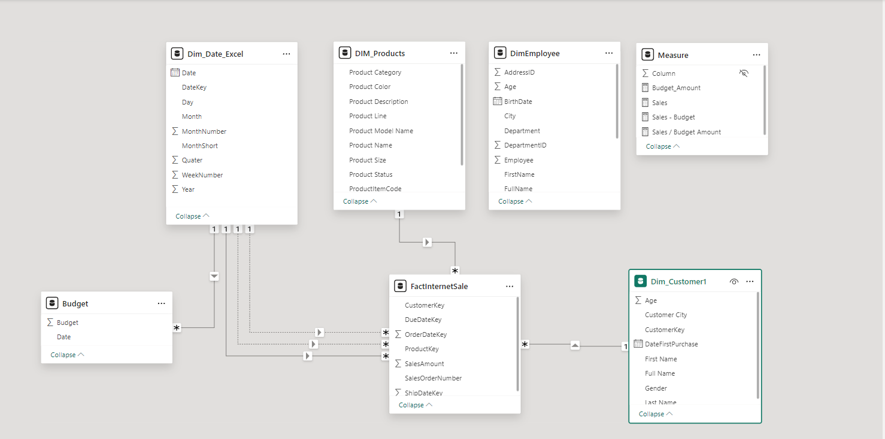
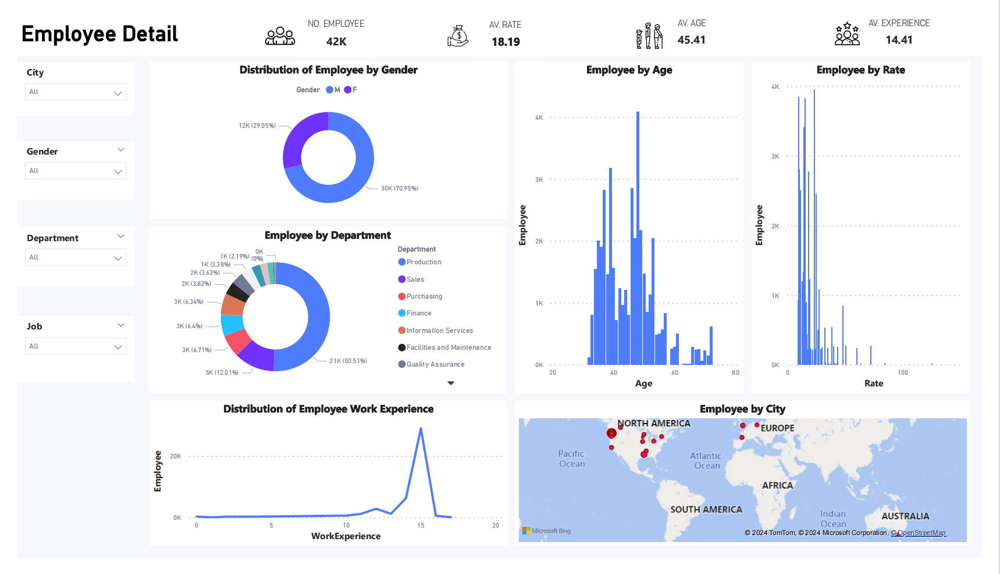
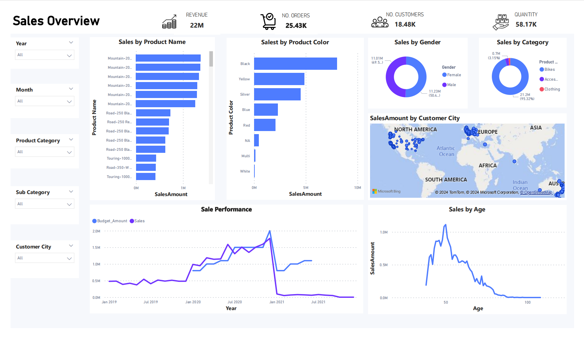

<<<<<<< HEAD
# AdventureWorks Database Visualization with PowerBI
## Introduction
This project explores the power of PowerBI in visualizing data with AdventureWorks database with the help of Microsoft SQL Sever in query editing. The database that was used for visualization & analysis was AdventureWorks.

Query editing tool: MSSQL Sever

Visualization tool: Power BI

Database link: https://learn.microsoft.com/en-us/sql/samples/adventureworks-install-configure?view=sql-server-ver15&tabs=ssms (AdventureWorks2019.bak and AdventureWorksDW2019 was chosen to be visualized)

## Entity Relationship Diagram Model

## Dashboard
i, Employee Dashboard

ii, Sales Overview Dashboad

=======
Hi
>>>>>>> 345791a1f231594e3be1cb96b380e98788f87bd7
